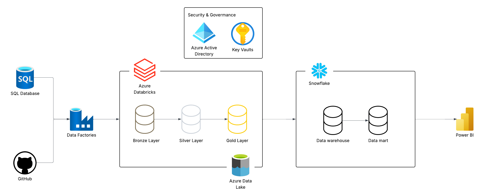

# Project Title
### | **Azure End-To-End Data Engineering Project**

# Project Description
- This project was built to support learning purpose which I followed and modified a tutorial on my own to practice modern Data Engineer tools: Azure cloud including many widely used services such as Azure Data Factory, Azure Data Lake Storage, Azure Databricks, Unity Catalog. 

- **📌 Note:** I've added my own documentation, diagrams, and new components for the system. I also made custom adjustments to the guided parts to gain a deeper understanding of how each componenet functions.

# Learning Goals
- Learn how to load data from external sources into Azure
- Understand how to use Azure Data Factory to automate data pipelines
- Apply incremental loading to ingest only new or updated data
- Use Azure Databricks for data transformation and modelling
- Learn how to model data into dimension and fact tables
- Construct storage layers using Medallion architecture on Azure Data Lake
- Utilize Databricks Unity Catalog for data governmance and convenient access to data stored in Azure Data Lake Storage

# Project Architecture

# Tech Stack
**Cloud Platform (Azure):**
- Azure Data Factory
- Azure Data Lake Storage Gen2
- Azure SQL Database
- Azure Databricks (with Unity Catalog)
- Azure Key Vault

**Data processing:**
- Apache Spark (via Databricks)

**Data warehouse / Data mart:**
- Snowflake
  
**Data visualization:**
- Power BI

**Programming:**
- Python
- SQL

# Customization & Improvements
- Re-designed the Azure Data Factory pipeline to support a more complex architecture
- Created and refined additional Databricks notebooks to align with the updated system
- Utilized Azure Key Vault to securely manage secrets and credentials
- Integrated Snowflake as a data warehouse for analytics and data mart support
- Documented all project stages using Notion
- Enhanced fact and dimension tables with additional fields (to support analytics and incremental loading)
- Implemented a Databricks tracking table to log last update time of  fact and dimension tables
- Built interactive Power BI dashboards based on data mart tables

# Further Documentation
Detailed documentation of this project, including diagrams and documentation for each stage: 
🔗 [Project Documentation Notion Page](https://www.notion.so/your-link-here)

# Reference tutorial
-  **[Azure End-To-End Data Engineering Project (Job Ready) | Azure Data Engineering Bootcamp](https://www.youtube.com/@AnshLambaJSR])**
-  I followed and modified it to suit my learning goals
